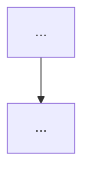

# Plan as Living Publishable Document — Design Spec

**Date**: 2026-04-20
**Topic**: devboard TUI v2.2 — plan.md 를 단일 living doc 으로 진화시켜 engineer + manager 청자 레이어링 + Jira/Confluence export 지원
**Status**: Approved — moving to writing-plans

## Motivation

현재 `devboard` 파이프라인이 생성하는 `plan.md` 는:
- Lock 시점에 frozen — 이후 "실제로 뭐가 됐는지" (outcome) 가 decisions.jsonl / commit history 에 흩어져 있어 한눈에 안 보임
- TUI v2.1 의 PlanMarkdown 은 plan.md + "▸ Raw Artifacts" (gauntlet 5 파일 concat) 을 분리 렌더 — summary/raw 분리가 사용자에게 어색하게 느껴짐
- Rich markdown 렌더 품질이 충분하지 않고, Jira/Confluence 에 붙이기엔 스타일/구조가 애매
- UI 태스크의 시각 증거 (스크린샷/다이어그램) 가 문서에 없음
- 회고(lesson) 는 별도 retro.md 에 저장되나 plan 과 연결 안 됨

**목표 청자**: (b) 팀 엔지니어 + (c) 매니저/PM, (e) 레이어링 구조로 같은 문서 안에서 두 청자 모두 충족.

## Scope

### In-scope
- `plan.md` 를 lock 후에도 섹션이 자라는 **단일 living doc** 으로 전환
- 신규 섹션: `## Metadata`, `## Outcome`, `## Screenshots / Diagrams`, `## Lessons`
- Skill hooks: gauntlet / approval / retro / tui_render_smoke 가 자동 append
- 멱등 (idempotent) upsert helper — 재실행해도 중복/손상 없음
- `devboard export <gid> --format md|html|confluence` CLI 명령 (후순위)

### Out-of-scope
- GoalSideList 네비게이션 개선 (별도 goal)
- `plan.md` ↔ `plan.json` 양방향 sync (일방향 유지; plan.json = locked snapshot)
- Multi-project export aggregation
- External sync (Jira API push, Confluence API push) — export는 로컬 파일만 생성
- Summary/Raw 두 뷰 체계 유지 (폐기)
- PlanMarkdown Rich 렌더링 엔진 교체 (Textual built-in Markdown 위젯 등)

## Architecture

### Data flow

```
gauntlet lock_plan
  │
  ├─► plan.json (locked machine state, unchanged)
  └─► plan.md (human doc, evolves over time)
        │
        ├─ gauntlet appends:  ## Metadata (locked_at, owner, branch, ...)
        ├─ approval appends:  ## Outcome (pushed_at, pr_url, tests, iter count)
        ├─ tui smoke appends: ## Screenshots / Diagrams (capture paths)
        └─ retro appends:     ## Lessons (learnings + retro narrative)
```

**핵심 원칙**: `compute_hash` 는 plan.json 만 보므로 plan.md 진화가 무결성 불변.

### 핵심 코드

신규 파일 `src/devboard/docs/plan_sections.py`:

```python
from enum import Enum
from pathlib import Path
import re

class PlanSection(str, Enum):
    METADATA = "Metadata"
    OUTCOME = "Outcome"
    SCREENSHOTS = "Screenshots / Diagrams"
    LESSONS = "Lessons"

def upsert_plan_section(
    plan_path: Path, section: PlanSection, content: str
) -> None:
    """Replace-or-append `## {section}` block in plan.md.

    If section exists: content between its heading and the next `## ` is
    replaced. If not: the block is appended to the end of the file.

    Idempotent: calling with the same args produces the same file. Uses
    the existing FileStore file_lock pattern for safety under concurrent
    skill runs.
    """
```

Each skill imports the helper and calls it at its lifecycle hook. No new abstractions beyond this module.

### Section contents

**## Metadata** (gauntlet lock, frozen)
```
- Goal ID: g_xxx
- Locked at: 2026-04-20T10:00:00+00:00
- Locked hash: abc123
- Owner: ctmctm <ctm0615@gmail.com>
- Branch: main
- Created: 2026-04-20T09:50:00+00:00
```

**## Outcome** (approval push, replaceable)
```
- Status: pushed
- Final commit: 4d7d7b9
- PR: direct push to origin/main (or URL)
- Iterations: 12
- Tests: 412 passing
- Red-team: 3 rounds, final SURVIVED
- CSO: not required (security_sensitive_plan=false)
- Pushed at: 2026-04-20T12:34:56+00:00
```

**## Screenshots / Diagrams** (optional, tui_smoke capture + manual mermaid)
```
### TUI real-TTY capture (2026-04-20T12:34:56)
- Path: .devboard/goals/<gid>/captures/tui_20260420_123456.txt
- Result: mounted=True, captured_bytes=4821, duration_s=3.0

### Architecture diagram (manual)

```

**## Lessons** (retro, replaceable)
```
- Learning: <name> — <summary>
- Learning: <name> — <summary>
- Pattern detected by retro: <narrative>
- Next-apply notes: ...
```

## Implementation plan (5 sequential goals)

### Goal #1 — `plan_sections` infra + Outcome (approval) — FIRST
- `src/devboard/docs/__init__.py` + `plan_sections.py`
- `upsert_plan_section()` + `PlanSection` enum
- `devboard-approval` SKILL.md: push 성공 후 (정확한 시점: `devboard_push_pr` 성공 반환 + `devboard_checkpoint "converged"` 직후, `devboard_update_task_status "pushed"` 직전) Outcome write 단계 추가
- TDD (axis 2 rule 적용):
  - happy: append when missing
  - edge empty: plan.md 빈 파일일 때
  - edge replace: 기존 섹션 replace (idempotent)
  - edge binary: plan.md 가 non-UTF-8 일 때 graceful (try/except)
  - edge concurrent: file_lock 동시 write
- Expected atomic_steps: 8-10

### Goal #2 — Metadata 섹션 (gauntlet lock 확장)
- `devboard_lock_plan` MCP tool 또는 gauntlet SKILL.md 에서 lock 직후 Metadata upsert
- git config user/email/branch 추출 helper
- TDD: git config 없을 때 fallback, ISO ts 형식, lock_plan 회귀 테스트
- Expected atomic_steps: 4-5

### Goal #3 — Lessons 섹션 (retro 연동)
- `devboard-retro` SKILL.md: retro 생성 후 plan.md 에 Lessons 요약 append
- 다중 goal retro 시 per-goal 분리 투영
- TDD: learnings 포맷, retro 존재/부재, 재실행 idempotency
- Expected atomic_steps: 4-5

### Goal #4 — Screenshots/Diagrams 섹션 (tui_render_smoke 연계)
- Captures 저장: `.devboard/goals/<gid>/captures/tui_<ts>.txt`
- UI 태스크 감지 방식: `task.metadata.ui_surface: bool` 필드 신설 (gauntlet 이 arch.md 에 TUI/UI 키워드 감지 시 true 설정). 기존 `production_destined` 와 동일 패턴.
- TDD/approval skill 이 `ui_surface=true` 인 task 에 한해 capture 실행 + path 를 Screenshots 섹션에 upsert
- TDD: capture 파일 저장, 링크 생성, UI 아닌 태스크에선 skip, metadata 필드 누락 시 default false
- Expected atomic_steps: 3-4

### Goal #5 — `devboard export` + Markdown 호환성 (LAST)
- `devboard export <gid> --format md|html|confluence` CLI
- Confluence-flavored: `||header||`, `{code}...{code}`, `*bold*`
- HTML: pandoc 없이 순수 파이썬 (rich.markdown → rich.console.export_html)
- TDD: 각 포맷 snapshot, manual paste 검증은 external
- Expected atomic_steps: 6-8

## Error handling

- `upsert_plan_section()` 은 plan.md 가 없으면 OSError가 아니라 첫 작성으로 fallback
- plan.md 가 non-UTF-8 (corruption) 이면 skill 은 경고 출력 후 skip, 기존 내용 파괴 금지
- 동시 write race: FileStore 의 `file_lock` (fcntl.LOCK_EX) 재사용
- Git config 없을 때 (CI 등) Metadata 의 owner 를 `"unknown"` 으로 대체

## Testing strategy

- **mock 금지** — 실 파일 IO, 실 git config, 실제 subprocess 필요시
- Goal #1: `plan_sections` 단위 테스트 (tmp_path 기반, concurrent write 시뮬레이션은 threading)
- Goal #2-4: 각 skill 수정은 string assertion + behavior assertion 혼합
- Goal #5: 포맷별 snapshot 테스트 + manual smoke (Confluence paste)
- 전체 suite 회귀 (현재 441 passing, 각 goal 후 N+ N_step_tests)

## Risks

- **R1 (MEDIUM)** — 5개 goal 순차 진행 시 후속 goal 이 plan_sections API 에 의존. API 초기 설계가 잘못되면 뒷 goal 에서 재작업 발생. 완화: Goal #1 에서 upsert 시그니처를 최대한 안정적으로 만들고, enum/dataclass 로 확장성 확보
- **R2 (MEDIUM)** — gauntlet / approval / retro skill 수정이 세 skill 파일 모두 건드림. 파일 단위 머지 충돌 위험. 완화: skill 별 goal 분리 (Goal #1=approval만, #2=gauntlet만, #3=retro만)
- **R3 (LOW)** — `## Outcome` 가 stakeholder 에게 보이는 레벨이 부족할 수 있음. 완화: 실 Confluence paste 후 피드백 받아 Goal #5 에서 포맷 조정
- **R4 (LOW)** — Screenshots capture 파일이 커지면 `.devboard/` 용량 증가. 완화: capture 는 text-only (ANSI 포함) 로 저장, 용량 작음

## Success criteria

- `devboard board` 에서 한 goal 을 열면 Metadata ~ Lessons 전체가 한 화면에서 스크롤로 읽힘 (summary/raw 분리 제거)
- Approval push 후 plan.md 의 Outcome 섹션에 push 결과가 자동 기록됨
- Retro 실행 후 plan.md 의 Lessons 에 회고 요약이 들어감
- `devboard export <gid> --format confluence` 결과물이 Confluence paste 시 테이블/코드블록이 깨지지 않음
- 현재 테스트 suite 전부 통과 (+ 새 테스트 누적 ~30+)

## Next step

Invoke `writing-plans` skill to produce the detailed implementation plan for **Goal #1** (plan_sections infra + Outcome). Goals #2-5 will be separate plan/TDD cycles.
