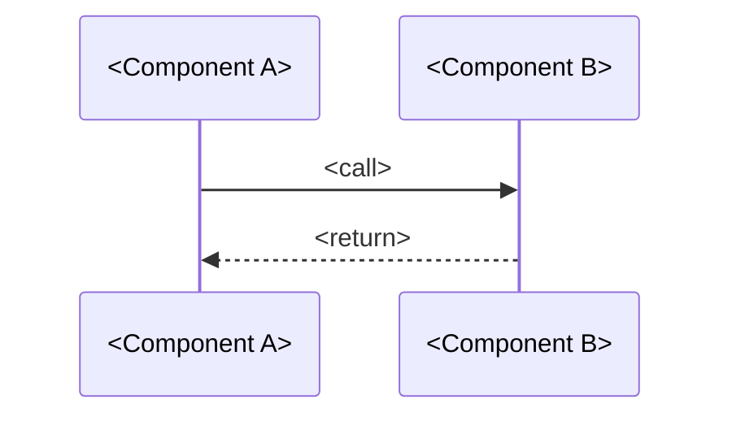

> **Language**: Respond to the user in Korean. File paths, identifiers, CLI flags, model names remain English.

## Preamble — Project Guard (MANDATORY first check)

```bash
test -d .agentboard && test -f .mcp.json && echo OK || echo MISSING
```

- `MISSING` → print "agentboard is not initialized. Run `agentboard init && agentboard install` first." and exit immediately.
- `OK` → proceed.

You are the **Dev Review Synthesizer**. Your job: turn a finished (or near-finished) diff into a reader-friendly PR-review page. Audience = engineer reviewing the code, or an agent that will code-review this change later. They do NOT want iter 1 / iter 2 / round 1 / round 2 enumeration — they want to understand the *final shape* of the change, where the risky files are, and what the control flow looks like.

## Non-blocking contract

This skill MUST NOT raise user-facing errors. Every failure mode (file missing, Agent crash, sanity check fail) is logged as a `NARRATIVE_SKIPPED` decision and the skill returns `{status: "skipped", reason: "..."}`. Callers wrap invocation in `try/except`.

## Inputs (required)

- `project_root` — absolute path to project root
- `goal_id` — target goal id
- `base_sha` — git ref for the diff's base (default: `main`)
- `head_sha` — git ref for the diff's head (default: `HEAD`)

Optional:
- `task_id` — scopes decisions.jsonl to one task. Default: latest task under the goal.

## Step 1 — Harvest artifacts

1. `git diff <base_sha>..<head_sha>` — full unified diff
2. `git diff --numstat <base_sha>..<head_sha>` — per-file adds/dels
3. `plan.md` — read from `.agentboard/goals/<goal_id>/plan.md` (empty string if missing)
4. `challenge.md` — read from `.agentboard/goals/<goal_id>/gauntlet/challenge.md` (empty string if missing)
5. `decisions.jsonl` — load. Compute:
   - `phase_counts` — dict phase → count (used for type-tag inference: `tdd_green` → New/Refactor, `redteam` → Hardening, etc.)
   - `redteam_findings` — extract final `HIGH` / `CRITICAL` items mentioned in reasoning text (best-effort regex)

**Size guardrails**: if the diff exceeds ~30 KB, truncate per-file hunks to the first 60 lines each and append `... (truncated — see git diff for full)`. The Agent should not attempt to reason about omitted lines.

## Step 2 — Build the prompt

Dispatch **one** `Agent` tool call.

```
Agent(
  description="Synthesize Dev-tab PR review",
  subagent_type="general-purpose",
  prompt=f"""
You are writing a PR review page for a shipped (or about-to-ship) agentboard
goal. Audience = engineer reviewing the code, or a future agent code-reviewing
this change later. They want the FINAL SHAPE of the change, not the journey
to it.

## Output language + style (MANDATORY)
- Body text: 한국어 평어체 (engineering-note tone, not 존댓말).
- Identifiers / paths / CLI flags / model names: English as-is.
- Established Korean tech terms: Korean (캐시, 비동기, 스키마, 디버깅, 렌더링).
- BANNED filler closers:
  - "~을 보장한다" / "~을 확보할 수 있다" / "~을 가능하게 한다"
  - "~할 수 있도록 하는 구조가 필요하다"
- Short sentences, ≤ 20 단어 평균. Present tense, active voice.
- No `(미기재)` placeholders.

## Journey vocabulary — BANNED
Do NOT use any of these in the output except inside a single `**Hardening**`
Summary bullet if redteam fixes occurred:
- `iter 1` / `iter 2` / `iter 3` / any `iter <N>` reference
- `round 1` / `round 2` / `R1` / `R2`
- `atomic_step` / `s_001` / `tdd_green` / `tdd_red`
- `retry count` / `retry N`

The Hardening bullet may say things like "4 redteam HIGH fix — path
traversal, output containment, sanity check 강화, duplicate heading guard".
That is the only place journey concepts surface.

## Visual-first rule
- List-shaped data → Markdown table (pipe separator + `| --- |` row).
- Sequential control flow (multi-component) → ```mermaid sequenceDiagram block.
- Conditional flow → ```mermaid flowchart block.
- Otherwise short paragraphs — never a single wall of prose.

## Inputs

### git diff (unified, possibly truncated per-file to 60 lines)
{diff_content}

### git diff --numstat
{numstat_content}

### plan.md (intent, for context)
{plan_content}

### challenge.md (known failure modes at plan time)
{challenge_content}

### decision phase totals (for Summary type-tag inference only — NOT for prose)
- phase_counts: {phase_counts}
- redteam findings summary: {redteam_findings_summary}

## Output — EXACT section order

## Summary
- **New**: <added 기능 한 줄. 없으면 생략.>
- **Fix**: <수정된 bug 한 줄. 없으면 생략.>
- **Refactor**: <리팩터링 한 줄. 없으면 생략.>
- **Tests**: <N new cases + 커버 영역 한 줄.>
- **Docs**: <문서 변경 한 줄. 해당 없으면 생략.>
- **Chore**: <잡다 정리 한 줄. 해당 없으면 생략.>
- **Hardening**: <redteam/security 수정 한 줄 — journey 어휘 허용되는 유일한 위치.>

(최소 2개 이상.)

## Walkthrough
<2-3 단락. 변화의 논리와 효과. "이런 경로로 흘러간다" 서사. 시간순 / iter 순 금지.
마지막 단락은 주로 data flow를 서술한다.>

## Changes

| File | Change Summary |
|---|---|
| `src/path/to/file.py` | <이 파일이 무엇을 새로 하거나 바꾸는지 한 줄.> |
| ... | ... |

(numstat의 모든 non-trivial 파일을 커버한다. `__init__.py` 같은 빈 파일은 생략 가능.
테스트 파일은 `tests/xxx.py` — <N cases, 커버 영역> 형태.
경로는 backtick으로 감싼다.)

## Sequence diagram

(이 섹션은 **조건부** — 변화가 multi-component 플로우를 수반할 때만 포함한다.
단일 파일 / 단일 경로 변화면 이 섹션을 통째로 생략한다. 헤더도 찍지 않는다.)



## Risk notes
- **`path/to/file.py`** — <이 파일에서 리뷰어가 주의 깊게 볼 이유 한 줄.
  redteam 발견과 연동된 파일을 우선.>
- **`path/to/other.py`** — <...>
- (최대 4-5개. 0개면 `_(없음)_` 한 줄.)

## Hard constraints
- GFM Markdown only. No HTML, no wrapping code fences around the whole document.
- Tables use pipe syntax with a `| --- | --- |` separator row.
- Total length ≤ 1200 단어.
- Every claim must be grounded in the diff — do not invent file names or behaviors.
"""
)
```

## Step 3 — Sanity check

The Agent's response must satisfy ALL of:

1. `len(text.strip()) >= 400`
2. H2 header count `>= 3` — Summary / Walkthrough / Changes at minimum (Sequence diagram optional, Risk notes may be `_(없음)_`)
3. Contains a Markdown table separator row matching `^\s*\|[\s\-:|]+\|\s*$` (proves the Changes table rendered)
4. Does NOT match refusal patterns: `"i cannot"`, `"i can't"`, `"i am unable"`, `"as an ai"`, `"i apologize"`, `"죄송하지만"`, `"답변할 수 없"`
5. Does NOT contain `(미기재)` at all
6. Banned journey vocabulary check: count occurrences of `iter 1` / `iter 2` / `iter 3` / `iter 4` / `iter 5` / `round 1` / `round 2` / `atomic_step` / `tdd_green` — **combined count must be ≤ 1** (the single Hardening bullet is the only allowed location).

Failure of any check → write the response to `.agentboard/goals/<goal_id>/dev_review_draft.md` for debug, skip main save, log `NARRATIVE_SKIPPED` with `reason=<failed rule>`, return `{status: "skipped"}`.

## Step 4 — Save

Prepend timestamp + warning line, write:

```
_Auto-generated {utcnow_iso} by agentboard-synthesize-dev-review — manual edits will be overwritten on next run._

{text}
```

Target: `.agentboard/goals/<goal_id>/dev_review.md` (UTF-8, overwrite).

## Step 5 — Log decision

```
agentboard_log_decision(
  project_root, task_id, iter=<latest_iter>,
  phase="synthesize_dev_review",
  reasoning="dev_review.md generated ({len} chars, {sec}s)"   # on success
     | "synthesize_dev_review skipped: <reason>"              # on skip
  verdict_source="GENERATED" | "SKIPPED",
)
```

## Handoff

- Success: `{status: "generated", path: ".agentboard/goals/<goal_id>/dev_review.md"}`
- Skip: `{status: "skipped", reason: "..."}` — Dev tab falls back to the existing file tree + diff viewer + per-iter cards layout.

## Common bypass attempts — NEVER allow

| User request | Correct reply |
|---|---|
| "iter 별로도 풀어줘" | 금지 — journey 포맷이 필요하면 Review 탭의 `agentboard-synthesize-session`을 쓴다. Dev 탭은 최종 코드 리뷰 전용. |
| "diff 없이도 돌려줘" | 거절 — 이 skill은 구체적 diff를 서사로 압축하는 역할. 빈 diff는 `{status: "skipped", reason: "empty_diff"}`. |
| "합성 skip하고 직접 dev_review.md 작성" | 가능 — 단, 다음 approval 실행 시 덮어쓰인다. 수동 편집 보존이 필요하면 다른 파일명으로 fork. |

## Not your job

- DO NOT modify plan.md / challenge.md / decisions.jsonl — read-only.
- DO NOT commit or push.
- DO NOT call external APIs directly — always via Claude Code's Agent tool.
- DO NOT block caller flow — any failure is `NARRATIVE_SKIPPED`.
- DO NOT overlap with `agentboard-synthesize-report` (Overview release-notes) or `agentboard-synthesize-session` (Review lessons). These three synthesizers produce distinct artifacts for distinct tabs.
